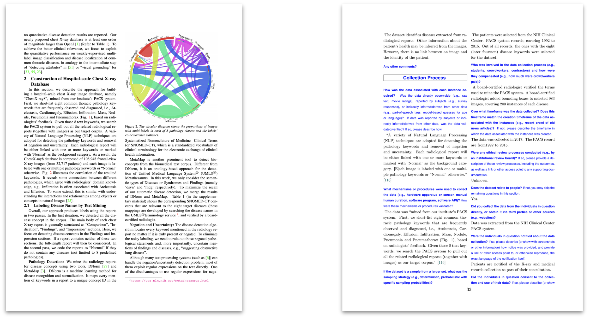
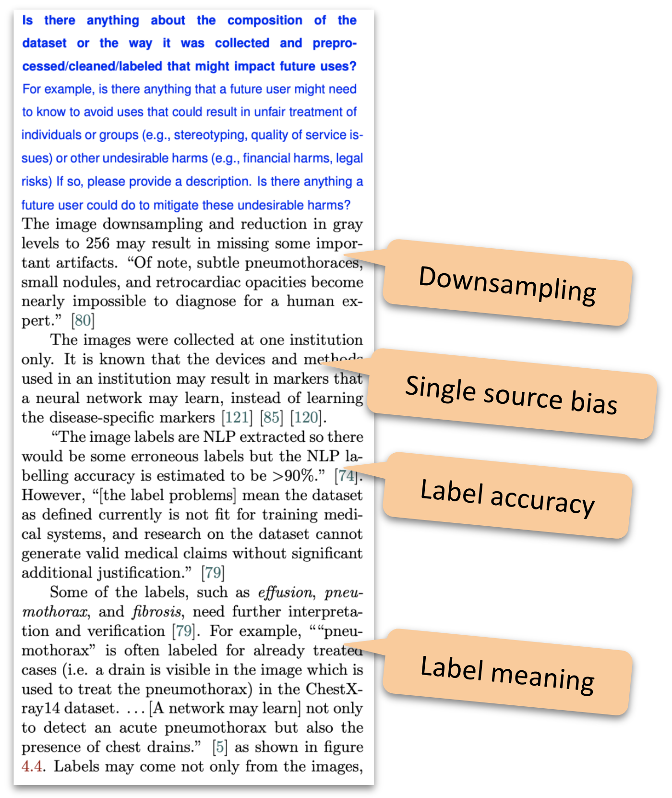

# ChestX-ray8 Datasheet

A [dataset datasheet](https://arxiv.org/abs/1803.09010) for the [ChestX-ray8 dataset](https://arxiv.org/abs/1705.02315), a.k.a. ChestX-ray14.

See [the PDF generated from the LaTeX files here](./chestx_ray8_datasheet.pdf).

The datasheet is written from the first-person point of view, as if the authors had created it, to make it more realistic.

Dataset datasheets "Document \[the dataset\] motivation, composition, collection process, recommended uses, and so on. \[They\] have the potential to increase transparency and accountability within the machine learning community, mitigate unwanted biases in machine learning systems, facilitate greater reproducibility of machine learning results, and help researchers and practitioners select more appropriate datasets for their chosen tasks." ([from the original paper](https://arxiv.org/abs/1803.09010)).

On the left side we see the prose format of the paper. On the right side we see the structured format of the dataset datasheet.

An item of the "Uses" section, describing the image format and label details.

## Templates

This datasheet was created with the [Overleaf template](https://www.overleaf.com/latex/templates/datasheet-for-dataset-template/jgqyyzyprxth). There is also a [Markdown template for datasheet for dataset](https://github.com/fau-masters-collected-works-cgarbin/datasheet-for-dataset-template).

## Another dataset datasheet

In collaboration with the the [CheXpert team](https://stanfordmlgroup.github.io/competitions/chexpert/), we created a [datasheet for the CheXpert dataset](https://arxiv.org/abs/2105.03020).

Accuracy is essential when documenting the details of a dataset. [Here is an example of using code](https://github.com/fau-masters-collected-works-cgarbin/chexpert_explorer) to create the tables in a datasheet to make the process reproducible, transparent, and auditable.

## Model cards

If you are interested in datasheets for datasets, you may also want to review [model cards](https://github.com/fau-masters-collected-works-cgarbin/model-card-template).
