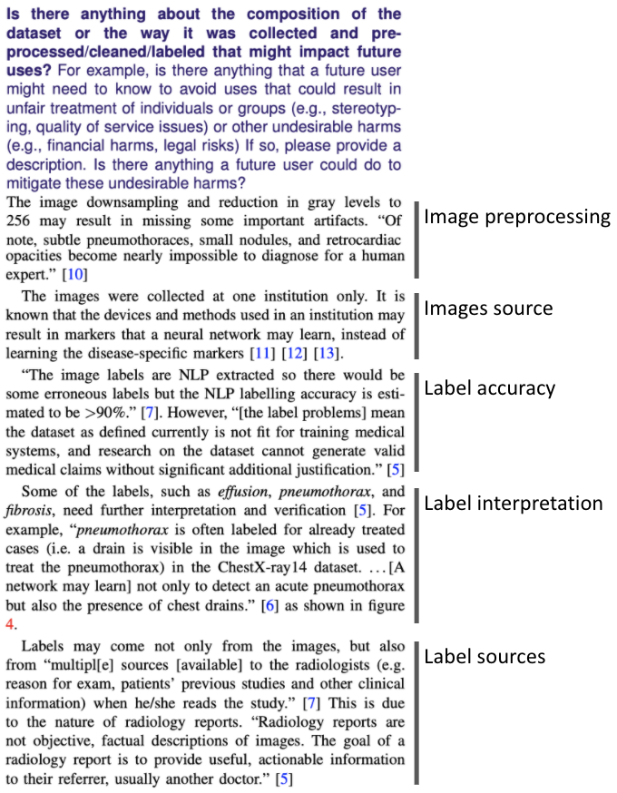

# ChestX-ray8 Datasheet

A [dataset datasheet](https://arxiv.org/abs/1803.09010) for the [ChestX-ray8 dataset](https://arxiv.org/abs/1705.02315), a.k.a. ChestX-ray14.

The datasheet is written from the first-person point of view, as if the authors had created it, to make it more realistic.

See [the PDF generated from the LaTeX files here](./chestx_ray8_datasheet.pdf).

Dataset datasheets "Document \[the dataset\] motivation, composition, collection process, recommended uses, and so on. \[They\] have the potential to increase transparency and accountability within the machine learning community, mitigate unwanted biases in machine learning systems, facilitate greater reproducibility of machine learning results, and help researchers and practitioners select more appropriate datasets for their chosen tasks." ([from the original paper](https://arxiv.org/abs/1803.09010)).

On the left side we see the prose format of the paper. On the right side we see the structured format of the dataset datasheet.

An item of the "Uses" section, describing the image format and label details.

Based on the [datasheet for dataset template in Overleaf](https://www.overleaf.com/latex/templates/datasheet-for-dataset-template/jgqyyzyprxth).
